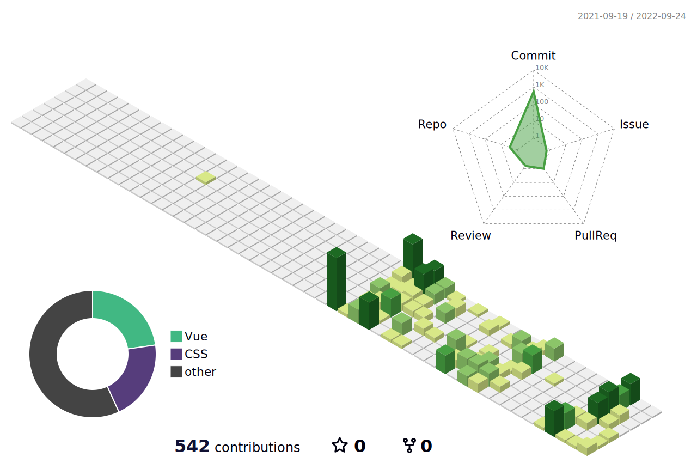

### 🔖 Language And Tools :

<br />
<br />

<p>
  
  
  
  
  
  
  
  
  
</p>

<br />

### 🌠 Weekly Development Breakdown :

<br />
<br />

<!--START_SECTION:waka-->

```text
From: 20 September 2022 - To: 27 September 2022

HTML             2 hrs 33 mins   ⣿⣿⣿⣿⣿⣿⣦⣀⣀⣀⣀⣀⣀⣀⣀⣀⣀⣀⣀⣀⣀⣀⣀⣀⣀   25.82 %
Python           2 hrs 26 mins   ⣿⣿⣿⣿⣿⣿⣄⣀⣀⣀⣀⣀⣀⣀⣀⣀⣀⣀⣀⣀⣀⣀⣀⣀⣀   24.74 %
YAML             1 hr 44 mins    ⣿⣿⣿⣿⣤⣀⣀⣀⣀⣀⣀⣀⣀⣀⣀⣀⣀⣀⣀⣀⣀⣀⣀⣀⣀   17.65 %
Markdown         1 hr 32 mins    ⣿⣿⣿⣷⣀⣀⣀⣀⣀⣀⣀⣀⣀⣀⣀⣀⣀⣀⣀⣀⣀⣀⣀⣀⣀   15.52 %
TypeScript       39 mins         ⣿⣶⣀⣀⣀⣀⣀⣀⣀⣀⣀⣀⣀⣀⣀⣀⣀⣀⣀⣀⣀⣀⣀⣀⣀   06.58 %
CSS              18 mins         ⣷⣀⣀⣀⣀⣀⣀⣀⣀⣀⣀⣀⣀⣀⣀⣀⣀⣀⣀⣀⣀⣀⣀⣀⣀   03.12 %
```

<!--END_SECTION:waka-->

<br />

### 🪅 GitHub Profile 3D Contrib :

<br />



<br />

##

<p align="center">
  
  
</p>
